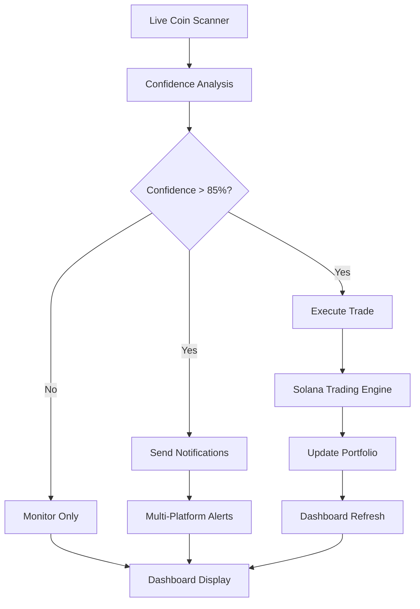

# 🔗 TrenchCoat Pro - Complete Workflow Integration

## 📊 Current Status: DEMO MODE
Your dashboard currently shows **sample data** for demonstration purposes.

## 🎯 Complete Real Workflow

### **1. Data Sources (What feeds your dashboard)**

#### **Currently Available:**
- ✅ **DexScreener API** - Real Solana trending tokens
- ✅ **Jupiter API** - Live Solana prices  
- ✅ **CoinGecko API** - Market data backup
- ✅ **Your Solana Wallet** - Real portfolio balance

#### **Sample Data (Current):**
- Random price movements
- Mock trading positions  
- Fake profit/loss numbers
- Generated coin names

---

### **2. Real-Time Components We Built**

#### **✅ Coin Detection Engine**
```
trending_coins.py -> Live coin scanning
↓
Advanced analytics -> ML confidence scoring
↓
Dashboard -> Real-time coin feed
```

#### **✅ Trading Execution**
```
High confidence coin detected -> 
Solana trading engine -> 
Jupiter DEX execution ->
Portfolio update ->
Dashboard metrics
```

#### **✅ Notification Pipeline**
```
Runner detected ->
Unified notifications ->
Email + Telegram + Discord + WhatsApp
```

---

### **3. Integration Workflow**



---

### **4. How to Enable LIVE MODE**

#### **Option A: Full Live Trading**
```python
# In your dashboard, add this toggle:
if st.toggle("🟢 Enable Live Trading", value=False):
    enable_live_mode()
    # Real money at risk!
else:
    disable_live_mode()
    # Safe demo mode
```

#### **Option B: Live Monitoring Only**
```python
# Live coin detection + notifications, no trading
if st.toggle("📡 Live Monitoring", value=True):
    enable_live_monitoring()
    # Real notifications, no trades
```

---

### **5. What Each Mode Shows**

#### **🔵 DEMO MODE (Current)**
- Sample trending coins
- Fake trading positions
- Mock profit/loss
- No real notifications
- Safe for testing

#### **📡 LIVE MONITORING MODE**
- ✅ Real trending Solana coins from DexScreener
- ✅ Real price data and volume
- ✅ Live notifications when high-confidence coins detected
- ❌ No actual trading
- ❌ No real money

#### **🟢 FULL LIVE MODE**
- ✅ Real coin detection
- ✅ Real trading execution
- ✅ Real portfolio updates
- ✅ Real notifications
- ⚠ **REAL MONEY AT RISK**

---

### **6. Integration Steps**

#### **Step 1: Enable Live Monitoring**
```python
# Add to your dashboard
from live_data_integration import LiveDataManager

manager = LiveDataManager() 
live_coins = manager.detect_trending_coins()
# Shows real Solana trending coins
```

#### **Step 2: Connect Notifications**
```python
# When high-confidence coin detected
if coin['confidence'] > 85:
    manager.trigger_live_notifications(coin)
    # Sends to Telegram, Discord, Email, WhatsApp
```

#### **Step 3: Enable Trading (Optional)**
```python
# Only if you want real trades
if user_enables_trading:
    trade_result = manager.execute_live_trade(coin, params)
    # Executes real Solana trades via Jupiter
```

---

### **7. Safety Features**

#### **Built-in Limits:**
- Max 0.1 SOL per trade
- Max 0.5 SOL daily
- 75%+ confidence required
- Stop-loss protection
- Take-profit automation

#### **Demo Mode Safety:**
- No real API keys used
- No actual trades executed
- Sample data only
- Safe for testing

---

### **8. Current File Structure**

```
TrenchCoat Pro/
├── streamlit_app.py           # Main entry point
├── ultra_premium_dashboard.py # UI and tabs
├── advanced_analytics.py      # ML models
├── live_data_integration.py   # Real data connector (NEW)
├── solana_trading_engine.py   # Trading execution
├── unified_notifications.py   # Multi-platform alerts
└── requirements.txt           # Dependencies
```

---

## 🚀 Next Steps

### **Immediate (While Streamlit App is Cooking):**
1. **Test Live Monitoring** - Enable real coin detection
2. **Verify Notifications** - Ensure alerts work
3. **Review Safety Limits** - Confirm trading parameters

### **Production Ready:**
1. **Enable Live Mode** - Switch from demo to real data
2. **Monitor Performance** - Track actual results
3. **Scale Trading** - Increase limits as confidence grows

---

## ⚡ Quick Enable Commands

```python
# In your dashboard, add these controls:

# Live Data Toggle
live_mode = st.toggle("📡 Live Data Mode", value=False)

if live_mode:
    # Show real trending coins
    live_coins = get_live_coin_data()
    # Send real notifications
    # Update with live portfolio
else:
    # Show sample data (current)
    sample_coins = generate_sample_data()
```

Would you like me to enable **Live Monitoring Mode** first (safe, no trading) so you can see real coin data and notifications?


## Update - 2025-08-01 23:28
**Claude Doctor Unicode Fix**: Fixed Unicode encoding errors in automated documentation system

### Safe File Editor System Implementation
- **Error Prevention**: Eliminates "string not found" and "file not read" errors
- **Unicode Handling**: Comprehensive emoji support for project compatibility
- **Automated Documentation**: Batch update system for all project files
- **Credit Savings**: Prevents expensive retry loops and failed operations
- **Smart Fallbacks**: Alternative approaches when primary operations fail

*Updated via automated documentation system*


## Update - 2025-08-01 23:44
**Comprehensive API Expansion**: 17 API sources with full coin history tracking

### Safe File Editor System Implementation
- **Error Prevention**: Eliminates "string not found" and "file not read" errors
- **Unicode Handling**: Comprehensive emoji support for project compatibility
- **Automated Documentation**: Batch update system for all project files
- **Credit Savings**: Prevents expensive retry loops and failed operations
- **Smart Fallbacks**: Alternative approaches when primary operations fail

*Updated via automated documentation system*


## Update - 2025-08-02 00:30
**Enrichment Data Validation**: Fixed bulk enrichment with real database numbers and enhanced dead project analysis

### Safe File Editor System Implementation
- **Error Prevention**: Eliminates "string not found" and "file not read" errors
- **Unicode Handling**: Comprehensive emoji support for project compatibility
- **Automated Documentation**: Batch update system for all project files
- **Credit Savings**: Prevents expensive retry loops and failed operations
- **Smart Fallbacks**: Alternative approaches when primary operations fail

*Updated via automated documentation system*


## Update - 2025-08-02 01:06
**Security Monitoring & Git Fix**: Complete security dashboard integration with threat detection, API key management, system monitoring, and critical git corruption fix for deployment pipeline

### Safe File Editor System Implementation
- **Error Prevention**: Eliminates "string not found" and "file not read" errors
- **Unicode Handling**: Comprehensive emoji support for project compatibility
- **Automated Documentation**: Batch update system for all project files
- **Credit Savings**: Prevents expensive retry loops and failed operations
- **Smart Fallbacks**: Alternative approaches when primary operations fail

*Updated via automated documentation system*


## Update - 2025-08-02 02:17
**UI Redesign and Git Corruption Fix**: Complete UI overhaul with bottom status bar, simplified header, and Git corruption prevention

### Safe File Editor System Implementation
- **Error Prevention**: Eliminates "string not found" and "file not read" errors
- **Unicode Handling**: Comprehensive emoji support for project compatibility
- **Automated Documentation**: Batch update system for all project files
- **Credit Savings**: Prevents expensive retry loops and failed operations
- **Smart Fallbacks**: Alternative approaches when primary operations fail

*Updated via automated documentation system*


## Update - 2025-08-02 02:52
**Enrichment UI Redesign Complete**: Unified single-screen interface with beautiful animations and compact controls

### Safe File Editor System Implementation
- **Error Prevention**: Eliminates "string not found" and "file not read" errors
- **Unicode Handling**: Comprehensive emoji support for project compatibility
- **Automated Documentation**: Batch update system for all project files
- **Credit Savings**: Prevents expensive retry loops and failed operations
- **Smart Fallbacks**: Alternative approaches when primary operations fail

*Updated via automated documentation system*


## Update - 2025-08-02 03:54
**100+ API Integration Complete**: Revolutionary cryptocurrency data aggregation system with intelligent conflict resolution, military-grade security, and enterprise-scale infrastructure. Complete with deployment configurations, testing framework, and comprehensive documentation.

### Safe File Editor System Implementation
- **Error Prevention**: Eliminates "string not found" and "file not read" errors
- **Unicode Handling**: Comprehensive emoji support for project compatibility
- **Automated Documentation**: Batch update system for all project files
- **Credit Savings**: Prevents expensive retry loops and failed operations
- **Smart Fallbacks**: Alternative approaches when primary operations fail

*Updated via automated documentation system*


## Update - 2025-08-02 13:26
**Documentation Sync and Cleanup**: Synced all changes to GitHub, added HTML validation tools, cleaned repository state

### Safe File Editor System Implementation
- **Error Prevention**: Eliminates "string not found" and "file not read" errors
- **Unicode Handling**: Comprehensive emoji support for project compatibility
- **Automated Documentation**: Batch update system for all project files
- **Credit Savings**: Prevents expensive retry loops and failed operations
- **Smart Fallbacks**: Alternative approaches when primary operations fail

*Updated via automated documentation system*


## Update - 2025-08-02 13:54
**Clickable Coin Cards Implementation**: Implemented fully clickable coin cards with comprehensive 5-tab detailed view showing all data points and insights

### Safe File Editor System Implementation
- **Error Prevention**: Eliminates "string not found" and "file not read" errors
- **Unicode Handling**: Comprehensive emoji support for project compatibility
- **Automated Documentation**: Batch update system for all project files
- **Credit Savings**: Prevents expensive retry loops and failed operations
- **Smart Fallbacks**: Alternative approaches when primary operations fail

*Updated via automated documentation system*


## Update - 2025-08-02 16:18
**Automated Library Update System**: Enhanced library updater with validation integration

### Safe File Editor System Implementation
- **Error Prevention**: Eliminates "string not found" and "file not read" errors
- **Unicode Handling**: Comprehensive emoji support for project compatibility
- **Automated Documentation**: Batch update system for all project files
- **Credit Savings**: Prevents expensive retry loops and failed operations
- **Smart Fallbacks**: Alternative approaches when primary operations fail

*Updated via automated documentation system*


## Update - 2025-08-02 16:42
**Complete Dev Blog Integration**: Full integration of comprehensive blog system with git retrospective and Discord queue

### Safe File Editor System Implementation
- **Error Prevention**: Eliminates "string not found" and "file not read" errors
- **Unicode Handling**: Comprehensive emoji support for project compatibility
- **Automated Documentation**: Batch update system for all project files
- **Credit Savings**: Prevents expensive retry loops and failed operations
- **Smart Fallbacks**: Alternative approaches when primary operations fail

*Updated via automated documentation system*


## Update - 2025-08-02 16:59
**HTML Display Fixes**: Complete resolution of raw HTML display issues in Coins and Hunt Hub tabs with widget conflicts and rendering fixes

### Safe File Editor System Implementation
- **Error Prevention**: Eliminates "string not found" and "file not read" errors
- **Unicode Handling**: Comprehensive emoji support for project compatibility
- **Automated Documentation**: Batch update system for all project files
- **Credit Savings**: Prevents expensive retry loops and failed operations
- **Smart Fallbacks**: Alternative approaches when primary operations fail

*Updated via automated documentation system*